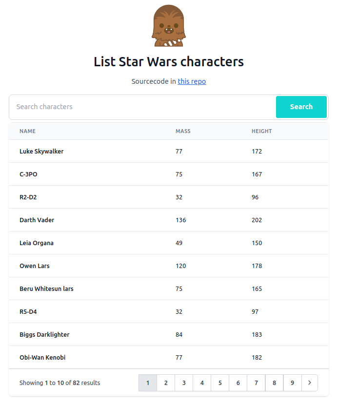

# List Star Wars characters and search by name
  

Check the [demo link](https://s4nt14go-star-wars.netlify.app)!

   

This repo consumes an AWS AppSync (GraphQL) API and by using Apollo is implemented an Optimistic UI: first checks if our query is already in Apollo cache, in that case shows the results right away, after that, launches the network request to the API, once we receive response from the API the results will update/overwrite the ones initially showed from the cache. Doing this the user gets fast response.

Also, when we refresh the page the last results and page is persisted. That's done saving Redux data in localStore.

### Techs used in this frontend
* React
* Apollo (GraphQL)
* Tailwind CSS
* Redux Toolkit 
* TypeScript
* CI/CD: Netlify

> The backend is in this [other repo](https://github.com/s4nt14go/star-wars-backend).
